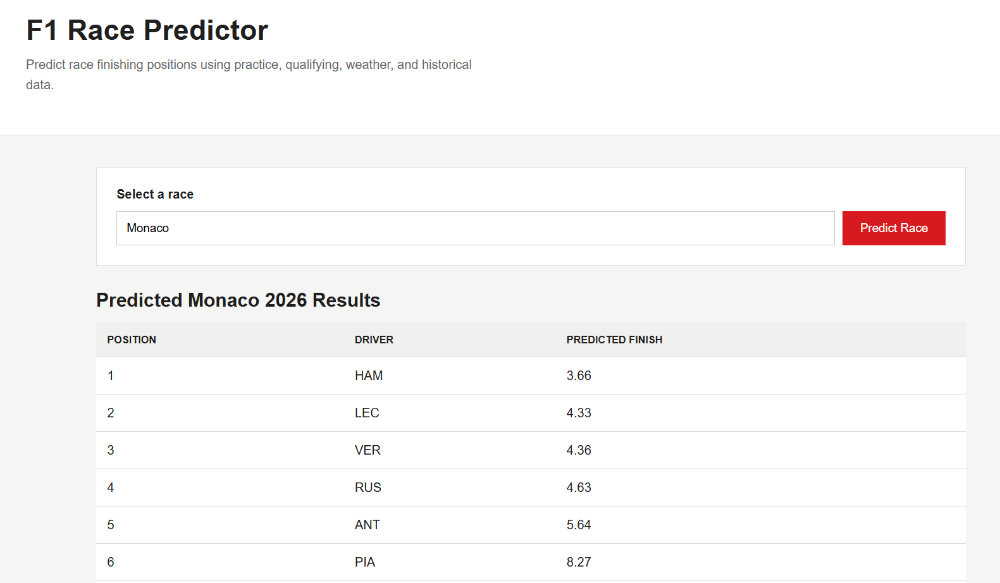

# F1 Race Prediction Platform

A machine learning project that predicts Formula 1 race finishing positions using practice, qualifying, weather, and historical race data.

## What it does

The project collects F1 session data using FastF1 and builds features based on:

* FP1 and FP2 pace
* Qualifying position and gap to pole
* Weather conditions
* Recent driver and team performance
* Previous performance at the same track

A Gradient Boosting model is then trained on historical races and used to predict finishing positions for upcoming races.

The project also includes a simple web interface where users can select a race and view the model's predictions.

## Tech Stack

* Python
* Pandas & NumPy
* scikit-learn
* FastF1
* SQLite / SQL
* FastAPI
* HTML, CSS & JavaScript
* Git

## Project Structure

```text
collect_data.py       # Collects and processes F1 data
features_utils.py     # Feature engineering and historical features
train_model.py        # Trains the ML model
evaluate_model.py     # Evaluates model performance
live_predictor.py     # Generates live race predictions
database.py           # Handles SQLite data
api.py                # FastAPI backend
frontend/             # Web interface
```

## How it works

```text
FastF1 → Feature Engineering → SQLite → ML Model → FastAPI → Web Interface
```

The model uses a chronological train/validation/test split so that future race results are not used when training on earlier races.



## Future Improvements

* Improve model accuracy and feature engineering
* Add more race and driver statistics
* Deploy the application
* Add visualizations for predictions and model performance
